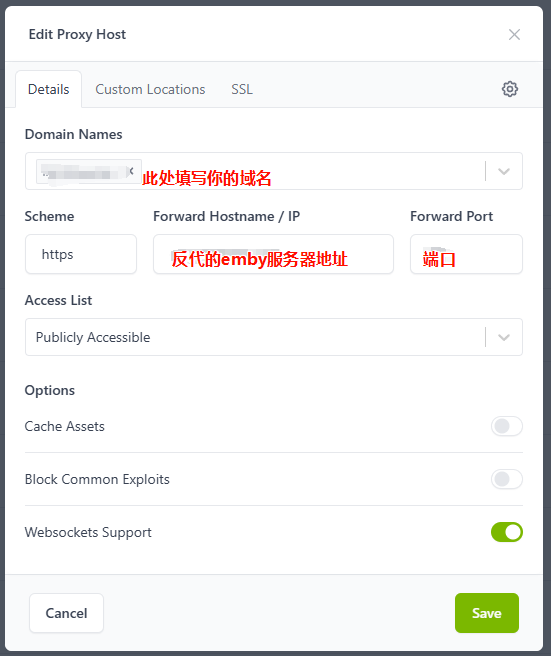
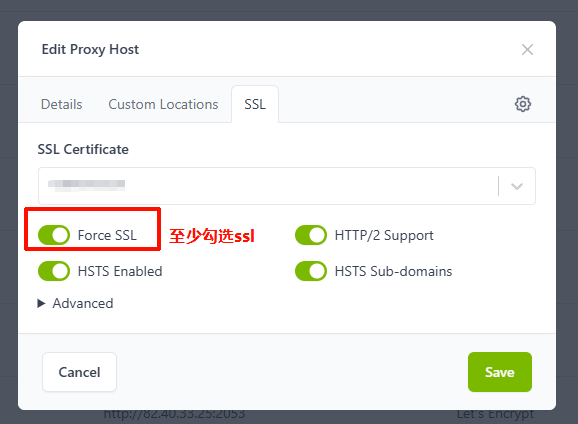

# Emby Reverse Proxy for Nginx Proxy Manager

在 [Nginx Proxy Manager (NPM)](https://nginxproxymanager.com/) 中反向代理 Emby 服务器的配置范例，核心目标：**减少不必要的代理暴露头信息、保持重定向与推流链路兼容、支持流媒体拖拽与断点续传**。

> **说明**：本文重点是提升 NPM 反代 Emby 时的兼容性与可用性；其中对请求头、响应头的处理，主要用于减少代理环境带来的额外暴露信息，并非鼓励对抗性用途。

## 适用场景

| 场景 | 说明 |
|------|------|
| 前后端不分离 | Emby 主站和推流在同一台服务器上，无独立推流节点 |
| 前后端分离 (HTTP 推流) | Emby 主站与推流节点分离，推流节点为 HTTP |
| 前后端分离 (HTTPS 推流) | 同上，但推流节点为 HTTPS，需额外配置 SNI |
| LilyEmby | 需要对响应体做域名替换的特殊场景（如 JSON/XML 中包含硬编码的源站域名） |

## 快速开始

### 1. 新建 Proxy Host — Details 页

填写你的域名、后端 Emby 地址和端口，**务必开启 Websockets Support**。

> **为什么要开 WebSocket**：Emby 的部分实时功能依赖 WebSocket；不开启时，可能出现会话状态不同步、播放控制异常或前端部分功能不正常。



### 2. SSL 页

选择 SSL 证书，**至少开启 Force SSL**。



### 3. Advanced 页

根据你的实际情况，从下面三种配置中选择一种，将内容粘贴到 **Custom Nginx Configuration** 文本框中，**修改其中的示例域名为你自己的域名**，然后保存。

## 配置说明

### 方案一：前后端不分离（[no-separation.txt](advanced-examples/no-separation.txt)）

> **适用于**：Emby 主站和推流在同一台服务器上，无独立推流节点。

最简单的配置。只需一个 `location /` 块，核心做三件事：

1. **伪装 Host** — 将 `Host` 和 `proxy_ssl_name` 设为后端实际地址，避免 SNI 不匹配和后端检测
2. **清除代理特征头** — 置空 `X-Real-IP`、`X-Forwarded-For`、`Via` 等所有暴露反代身份的请求头
3. **流媒体支持** — 透传 `Range` / `If-Range` 头以支持视频拖拽和断点续传，关闭 `proxy_buffering` 降低延迟

<details>
<summary>点击展开完整配置</summary>

```nginx
location / {
    # ---------------- 基础反代目标 ----------------
    proxy_pass $forward_scheme://$server:$port;

    # ---------------- 伪装后端 (防 Emby 识破) ----------------
    proxy_set_header Host $server;
    proxy_ssl_server_name on;
    proxy_ssl_name $server;

    # 覆盖并清空 NPM 默认自带的代理特征头
    proxy_set_header X-Real-IP "";
    proxy_set_header X-Forwarded-For "";
    proxy_set_header X-Forwarded-Proto "";
    proxy_set_header X-Forwarded-Host "";
    proxy_set_header X-Forwarded-Port "";
    proxy_set_header Via "";

    # ---------------- 流媒体支持 ----------------
    proxy_set_header Range $http_range;
    proxy_set_header If-Range $http_if_range;

    proxy_connect_timeout 60s;
    proxy_send_timeout 180s;
    proxy_read_timeout 180s;
    proxy_buffering off;

    # ---------------- 伪装客户端 (防客户端识破) ----------------
    proxy_hide_header X-Powered-By;
    proxy_hide_header X-Frame-Options;
    proxy_hide_header X-Content-Type-Options;
    more_clear_headers 'Server';
}
```

</details>

---

### 方案二：前后端分离 — HTTP 推流（[separation.txt](advanced-examples/separation.txt)）

> **适用于**：Emby 后端返回 302 重定向到独立 **HTTP** 推流域名（如 `stream1.example.com`、`stream2.example.com`）的部署架构。

在方案一的基础上增加了 **redirect 拦截 + 推流节点代理**：

1. **`proxy_redirect` 拦截重定向** — 将后端返回的推流域名重写为本地路径（如 `/s1/`、`/s2/`、`/s3/`）
2. **独立 `location` 块** — 为每个推流节点定义独立的代理入口，`rewrite` 去掉路径前缀后转发到真实推流节点
3. **每个节点独立伪装** — 推流节点的 `Host`、`Referer`、代理特征头各自独立处理

使用前需要修改以下占位符：

| 占位符 | 替换为 |
|--------|--------|
| `stream1.example.com` | 推流节点 1 的真实域名 |
| `stream2.example.com` | 推流节点 2 的真实域名 |
| `stream3.example.com` | 推流节点 3 的真实域名 |
| `yourdomain.com` | 你自己的反代域名 |
| `example-emby.com` | Emby 主站的源域名 |

> **提示**：推流节点数量可以按需增减，复制 `/s1/` 块并修改编号和域名即可。

<details>
<summary>点击展开完整配置</summary>

```nginx
# 核心入口：反代 Emby 主程序
location / {
    proxy_pass $forward_scheme://$server:$port;

    proxy_set_header Host $server;
    proxy_ssl_name $server;
    proxy_ssl_server_name on;

    proxy_set_header Range $http_range;
    proxy_set_header If-Range $http_if_range;

    # 将推流源重定向到伪装路径
    proxy_redirect http://stream1.example.com https://yourdomain.com/s1/;
    proxy_redirect http://stream2.example.com https://yourdomain.com/s2/;
    proxy_redirect http://stream3.example.com https://yourdomain.com/s3/;

    proxy_set_header X-Real-IP "";
    proxy_set_header X-Forwarded-For "";
    proxy_set_header X-Forwarded-Proto "";
    proxy_set_header X-Forwarded-Host "";
    proxy_set_header Forwarded "";
    proxy_set_header Via "";

    more_clear_headers 'Server';
    proxy_hide_header X-Powered-By;
}

# 推流节点 1
location /s1/ {
    rewrite ^/s1(/.*)$ $1 break;
    proxy_pass http://stream1.example.com;

    proxy_set_header Referer "https://example-emby.com/web/index.html";
    proxy_set_header Host $proxy_host;
    proxy_set_header Range $http_range;
    proxy_set_header If-Range $http_if_range;

    proxy_buffering off;
    proxy_connect_timeout 60s;
    proxy_read_timeout 300s;
    proxy_send_timeout 300s;

    proxy_set_header X-Real-IP "";
    proxy_set_header X-Forwarded-For "";
    proxy_set_header X-Forwarded-Proto "";
    proxy_set_header X-Forwarded-Host "";
    proxy_set_header Forwarded "";
    proxy_set_header Via "";

    more_clear_headers 'Server';
    proxy_hide_header X-Powered-By;
}

# 推流节点 2、3 结构相同，修改域名即可（完整版见源文件）
```

</details>

---

### 方案二-B：前后端分离 — HTTPS 推流（[separation-2.txt](advanced-examples/separation-2.txt)）

> **适用于**：与方案二相同的架构，但推流节点使用 **HTTPS**，需要额外配置 SNI 信息。

与方案二的核心区别：

1. **`proxy_redirect` 和 `proxy_pass` 使用 `https://`** — 匹配推流节点的实际协议
2. **推流节点增加 SNI 配置** — `proxy_ssl_server_name on` + `proxy_ssl_name` 确保 TLS 握手时发送正确的域名，否则证书校验失败

使用前需要修改以下占位符：

| 占位符 | 替换为 |
|--------|--------|
| `stream.example.com` | 推流节点的真实域名 |
| `yourdomain.com` | 你自己的反代域名 |
| `example-emby.com` | Emby 主站的源域名 |

> **提示**：如有多个 HTTPS 推流节点，复制 `/s1/` 块并修改编号、域名和 `proxy_ssl_name` 即可。

<details>
<summary>点击展开完整配置</summary>

```nginx
# 核心入口：反代 Emby 主程序
location / {
    proxy_pass $forward_scheme://$server:$port;

    proxy_set_header Host $server;
    proxy_ssl_name $server;
    proxy_ssl_server_name on;

    proxy_set_header Range $http_range;
    proxy_set_header If-Range $http_if_range;

    # 将 HTTPS 推流地址重定向到伪装路径
    proxy_redirect https://stream.example.com https://yourdomain.com/s1/;

    proxy_set_header X-Real-IP "";
    proxy_set_header X-Forwarded-For "";
    proxy_set_header X-Forwarded-Proto "";
    proxy_set_header X-Forwarded-Host "";
    proxy_set_header Forwarded "";
    proxy_set_header Via "";

    more_clear_headers 'Server';
    proxy_hide_header X-Powered-By;
}

# 推流节点（HTTPS）
location /s1/ {
    rewrite ^/s1(/.*)$ $1 break;
    proxy_pass https://stream.example.com;

    # HTTPS 推流必须配置 SNI
    proxy_ssl_server_name on;
    proxy_ssl_name stream.example.com;

    proxy_set_header Range $http_range;
    proxy_set_header If-Range $http_if_range;
    proxy_set_header Referer "https://example-emby.com/web/index.html";
    proxy_set_header Host $proxy_host;

    proxy_buffering off;
    proxy_connect_timeout 60s;
    proxy_read_timeout 300s;
    proxy_send_timeout 300s;

    proxy_set_header X-Real-IP "";
    proxy_set_header X-Forwarded-For "";
    proxy_set_header X-Forwarded-Proto "";
    proxy_set_header X-Forwarded-Host "";
    proxy_set_header Forwarded "";
    proxy_set_header Via "";

    more_clear_headers 'Server';
    proxy_hide_header X-Powered-By;
}
```

</details>

---

### 方案三：LilyEmby 特殊版（[lily-special.txt](advanced-examples/lily-special.txt)）

> **适用于**：后端在 JSON / XML 响应体中硬编码了源站域名，仅靠 `proxy_redirect` 无法覆盖所有场景。

在方案二的基础上引入了 **`sub_filter` 响应体替换**：

1. **强制禁用压缩** — `proxy_set_header Accept-Encoding ""` 使上游返回明文，否则 `sub_filter` 无法工作
2. **扩展替换范围** — `sub_filter_types` 覆盖 `application/json`、`text/xml`、`text/plain`
3. **全局替换** — `sub_filter_once off` 替换所有匹配项
4. **域名映射** — 将响应体中的源站域名和推流 CDN 域名全部替换为反代域名

使用前需要修改以下占位符：

| 占位符 | 替换为 |
|--------|--------|
| `www.example.com` | Emby 主站的源域名 |
| `stream.example.com` | 推流节点的真实域名 |
| `lily.yourdomain.com` | 你自己的反代域名 |
| `example-emby.com` | 用于伪装 Referer 的 Emby 域名 |

<details>
<summary>点击展开完整配置</summary>

```nginx
# 核心入口：反代 Emby 主站
location / {
    proxy_pass $forward_scheme://$server:$port;

    proxy_set_header Host $server;
    proxy_ssl_name $server;
    proxy_ssl_server_name on;

    proxy_set_header Range $http_range;
    proxy_set_header If-Range $http_if_range;

    # 处理 302 重定向
    proxy_redirect https://stream.example.com https://lily.yourdomain.com/s1;
    proxy_redirect https://www.example.com https://lily.yourdomain.com;

    # 响应体替换（核心）
    proxy_set_header Accept-Encoding "";
    sub_filter_types application/json text/xml text/plain;
    sub_filter_once off;
    sub_filter 'https://www.example.com' 'https://lily.yourdomain.com';
    sub_filter 'https://stream.example.com' 'https://lily.yourdomain.com/s1';

    proxy_set_header X-Real-IP "";
    proxy_set_header X-Forwarded-For "";
    proxy_set_header X-Forwarded-Proto "";
    proxy_set_header X-Forwarded-Host "";
    proxy_set_header Forwarded "";
    proxy_set_header Via "";

    more_clear_headers 'Server';
    proxy_hide_header X-Powered-By;
}

# 推流节点代理
location /s1/ {
    rewrite ^/s1(/.*)$ $1 break;
    proxy_pass https://stream.example.com;

    proxy_ssl_server_name on;
    proxy_ssl_name stream.example.com;

    proxy_set_header Range $http_range;
    proxy_set_header If-Range $http_if_range;
    proxy_set_header Host $proxy_host;
    proxy_set_header Referer "https://example-emby.com/web/index.html";

    proxy_buffering off;
    proxy_connect_timeout 60s;
    proxy_read_timeout 300s;
    proxy_send_timeout 300s;

    proxy_set_header X-Real-IP "";
    proxy_set_header X-Forwarded-For "";
    proxy_set_header X-Forwarded-Proto "";
    proxy_set_header X-Forwarded-Host "";
    proxy_set_header Forwarded "";
    proxy_set_header Via "";

    more_clear_headers 'Server';
    proxy_hide_header X-Powered-By;
}
```

</details>

## 三种方案对比

| 特性 | 不分离 | 分离 (HTTP) | 分离 (HTTPS) | LilyEmby |
|------|:------:|:-----------:|:------------:|:--------:|
| 配置复杂度 | 低 | 中 | 中 | 高 |
| 推流节点协议 | - | HTTP | HTTPS | HTTPS |
| 独立推流节点 | - | 多节点 | 单/多节点 | 单/多节点 |
| SNI 配置 | 仅主站 | 仅主站 | 主站 + 推流 | 主站 + 推流 |
| 302 重定向拦截 | - | `proxy_redirect` | `proxy_redirect` | `proxy_redirect` |
| 响应体域名替换 | - | - | - | `sub_filter` |
| 隐藏代理特征 | 请求头 + 响应头 | 请求头 + 响应头 | 请求头 + 响应头 | 请求头 + 响应头 + 响应体 |

**选择建议**：

- 只有一台 Emby 服务器、无推流分离 → **方案一**
- 后端有独立推流节点、推流为 HTTP → **方案二**
- 后端有独立推流节点、推流为 HTTPS → **方案二-B**
- 后端在 API 响应中硬编码了源站域名 → **方案三**

## 关键指令速查

| 指令 | 作用 | 为什么需要 |
|------|------|-----------|
| `proxy_set_header Host $server` | 伪装 Host 为后端地址 | 防止后端检测到反代域名 |
| `proxy_ssl_name` / `proxy_ssl_server_name on` | 设置 SNI | HTTPS 后端必须，主站和 HTTPS 推流节点都需要配置 |
| `proxy_set_header X-Real-IP ""` | 清空代理特征头 | NPM 默认会加这些头，暴露反代身份 |
| `proxy_set_header Range $http_range` | 透传 Range 头 | 视频拖拽/断点续传必需 |
| `proxy_buffering off` | 关闭响应缓冲 | Emby 官方推荐，降低播放延迟 |
| `more_clear_headers 'Server'` | 清除 Server 响应头 | 隐藏 Nginx 身份（依赖 NPM 内置 OpenResty） |
| `proxy_redirect` | 重写 302 重定向目标 | 拦截推流域名跳转 |
| `sub_filter` | 替换响应体内容 | 处理 JSON/XML 中硬编码的源站域名 |

## 占位符替换说明

### 必须替换

下列示例值必须改成你自己的实际环境，否则配置只能当摆设：

- `yourdomain.com`：你自己的反代域名
- `lily.yourdomain.com`：LilyEmby 场景使用的反代域名
- `stream.example.com` / `stream1.example.com` / `stream2.example.com` / `stream3.example.com`：真实推流节点域名
- `example-emby.com` / `www.example.com`：Emby 主站源域名或你用于伪装 `Referer` 的目标域名

### 不要修改

下列内容是 NPM 或 Nginx 在运行时使用的变量/指令，除非你明确知道后果，否则不要改：

- `$forward_scheme`
- `$server`
- `$port`
- `$http_range`
- `$http_if_range`
- `proxy_buffering off`
- `proxy_ssl_server_name on`

## 常见问题 / 故障排查

### 1. 能打开首页，但播放失败

常见原因：

- `proxy_redirect` 没匹配到 Emby 实际返回的推流域名
- `/s1/`、`/s2/` 这类伪装路径和 `rewrite` 规则不一致
- 推流节点对 `Host` 或 `Referer` 有校验，当前值不匹配
- HTTPS 推流缺少 `proxy_ssl_server_name on` 或 `proxy_ssl_name`

### 2. 可以播放，但拖拽 / 快进失败

常见原因：

- 没有透传 `Range` / `If-Range`
- 上游推流节点本身不支持 Range 请求
- 某一层代理或缓存破坏了 206 Partial Content 响应

### 3. HTTPS 推流报证书错误

常见原因：

- `proxy_pass` 使用的地址与 `proxy_ssl_name` 不一致
- 上游证书的 CN / SAN 与推流域名不匹配
- Details 页填的是 IP，但上游 HTTPS 证书签发给的是域名

### 4. LilyEmby 方案下 `sub_filter` 不生效

常见原因：

- 上游响应仍然是 gzip 压缩内容，`sub_filter` 无法处理
- 实际响应的 `Content-Type` 不在 `sub_filter_types` 范围内
- 后端返回的不是完整绝对 URL，而是其他格式，导致替换规则没命中

### 5. NPM 保存配置时报错

常见原因：

- Custom Nginx Configuration 中写入了不允许出现在该上下文的指令
- 分号、引号或路径前缀写错
- 复制配置时遗漏了某一行，导致 `location` 块不完整

## 注意事项

- `more_clear_headers` 指令依赖 OpenResty 的 `headers-more-nginx-module` 模块，NPM 默认已内置，无需额外安装
- `sub_filter` 和 gzip 压缩互斥 — 使用方案三时必须通过 `Accept-Encoding ""` 禁用上游压缩
- 所有配置中的 `$forward_scheme`、`$server`、`$port` 是 NPM 内置变量，会自动替换为 Details 页填写的值，**不需要手动修改**
- 超时时间可按需调整，推流节点建议设置更长的 `proxy_read_timeout`（默认 300s）以应对大文件播放
